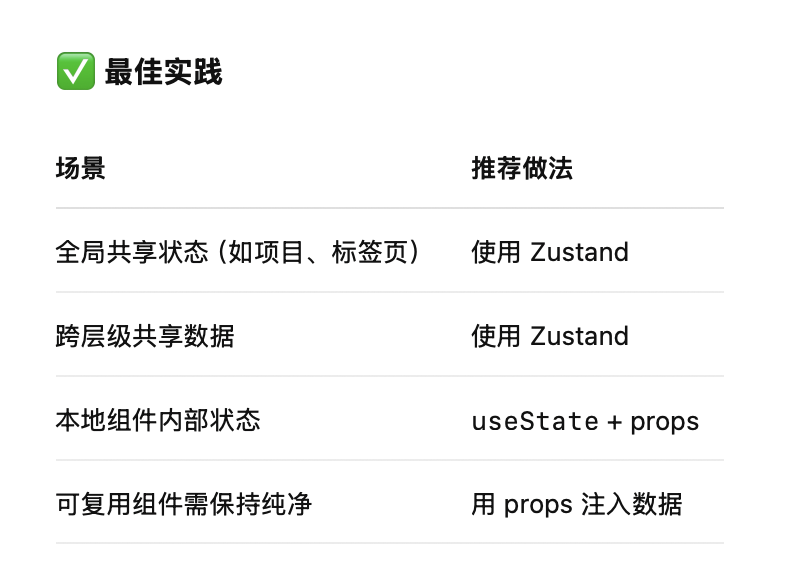
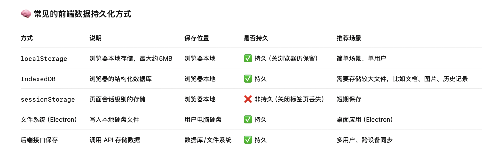

1. 主进称使用  **ES Module（ESM）、CommonJS **
2. TypeScript基础知识
- type、interface 区别, 使用场景，项目中怎么选

2. 怎么判断主进程是否支持 ts
    - ts 跟 js 的区别
3. Electron 如何支持菜单中英文切换
4. Electron 能做哪些, 不能做哪些
5. 渲染进程 跟 主进程 怎么互相通信
6. 目录树的刷新与渲染，特别是操作目录树后，如果保证UI显示是及时且正确的
7. React 下 useState、useEffect 详细了解含意、作用及用法
    - useState:  状态管理 Hook; 用来在函数组件中定义组件级别的“状态变量”
    - useEffect: 副作用处理 Hook; 常用于：组件挂载后执行初始化逻辑、监听依赖变化、清理资源等

   ```tsx
   const [count, setCount] = useState(0);
   ```
8. 怎么管理全局状态 Zustand
9. 怎么发现组建被重复渲染，然后怎么避免
- why-did-you-render 跟第三方组件容易冲突
- electron electron-devtools-installer 也一直不出现 Profiler
10. 怎么数据持久化，开发环境怎么清理这个持久化
11. 什么时候组件需要 props？
    
12. zustand 的 set 的不同写法，推荐写法是什么
  - set({ activeFile: file }) //  不需要返回
  - set((state) => { ... }) // 必须返回

13. JavaScript 里面 .map  .filter .some 这三个方法分别是什么意思，作用是啥
 - .map() 作用：将数组“映射”为一个新数组，对每个元素执行操作，返回的数组和原数组长度一致
 - .filter() 作用：筛选数组中满足条件的元素，返回一个“子集”数组。
 - .some() 作用：判断数组中是否“至少有一个元素”满足条件，返回布尔值 true 或 false。
14. 数据怎么持久化，有哪些方式，各自特点是什么，持久化的数据是保存在哪儿的
    - localStorage
    - IndexedDB
    - sessionStorage
    - 文件系统（Electron）
    - 后端接口保存
    - electron-store 坑！！！
      - v8 是纯 CommonJS，内部不包含 import.meta.url / ESM 特性，兼容性更好。
      - ⚠️ 注意：v9 及以后为 ESM-only，如果被构建工具打进渲染进程，可能触发 electron: 错误。
      - 降级使用 electron-store@8 `yarn add electron-store@8`
    


15. store 跟 hooks的区别是啥，怎么判断一个文件该放到store 还是放到hooks
    > store 跟 hooks的区别是啥，怎么判断一个文件该放到store 还是放到hooks
16. Hook 的规范写法
    - 所有 Hook 必须以 use 开头
    - Hook 只能在顶层调用（不能在条件语句、循环中用）
    - Hook 只能在函数组件或其他 Hook 中调用
17. 下面写法的区别
    ```ts
    const projects = useProjectsStore((s) => s.projects);
    const {projects} = useProjectsStore.getState();
    ```
    1. useProjectsStore((s) => s.projects)
       是 响应式订阅（reactive,当 projects 发生变化时，组件会自动重新渲染
       适用场景：
       - React 函数组件内部
       - 你需要在 UI 中“自动感知”状态变化
    2.  useProjectsStore.getState()
        是 非响应式读取（static snapshot）, 它不会让组件订阅 Zustand 状态变化, 不会触发组件重渲染
        适用场景：
        - 状态只用一次，不关心变化（如在 useEffect 里初始化）
        - 在 store 外部使用（如 Electron 主进程通信、非组件代码）
        - 调试 / 日志打印
        - ipcRenderer.invoke() 参数等
        - .getState() 每次调用都是最新快照，适合一次性使用场景，如点击事件、ipc 响应等。

    根据上面，解释 新建标签文件，在 MainContentTabs 里面一直能检测到 openFiles 有值，但是保存时 openFiles 却没有值
18.


```
方案一：用现成的 Markdown 编辑器组件
推荐库
Milkdown：现代、所见即所得，支持 WYSIWYG 和源码切换。
@uiw/react-md-editor：支持实时预览和源码编辑。
tiptap + tiptap-extension-markdown: 强大富文本，可配合插件支持 Markdown。
Toast UI Editor：支持双栏即时预览和 wysiwyg。

方案二：自己组合
左边 <textarea>，右边用 marked/markdown-it 实时渲染。
WYSIWYG 可用 ProseMirror、Slate、Tiptap 等富文本引擎，配合 markdown 插件。
```


现在打开文件夹的流程
```
1. 点击菜单，选中打开文件夹按钮
2. Electron 的菜单实现弹窗，选择打开的文件夹，然后读取文件结构，给UI发送 `load-folder` 事件
3. UI绑定 `load-folder` 事件,读取数据，然后吧文件树渲染出来


[用户点击菜单 "打开文件夹"]
        ↓
Electron 主进程弹窗 → 获取路径
            ↓
主进程发送 `load-folder` → 渲染进程收到
            ↓
    渲染进程加载 folderTree 并显示
        ↓
主进程调用 watchFolder → 监听文件变化
        ↓
监听变化后 → 主进程发送 `folder-changed`
        ↓
渲染进程收到 → 调用 loadFolderTree 重新渲染

```


```
win.webContents.send("replace-folders")

window.electronAPI.on("replace-folders")

```

解耦啊，按照这个结构拆 components/
├── file-tree/
│   ├── FileTree.tsx           ← 主组件，递归渲染子节点
│   ├── TreeNode.tsx           ← 渲染单个节点（UI + 交互逻辑）
│   ├── NodeContextMenu.tsx    ← 右键菜单
│   ├── dialogs/
│   │   ├── CreateDialog.tsx   ← 新建对话框
│   │   ├── RenameDialog.tsx   ← 重命名对话框
│   │   └── DeleteDialog.tsx   ← 删除对话框
│   └── useTreeNode.ts         ← 节点状态逻辑（hooks）


setOpenFiles: React.Dispatch<React.SetStateAction<FileTab[]>>
