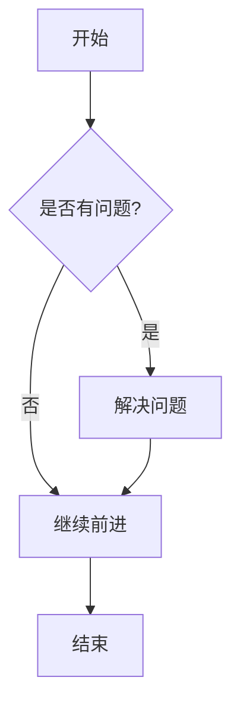
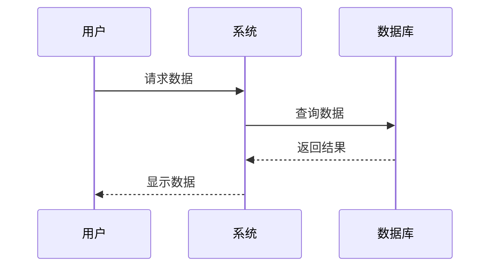
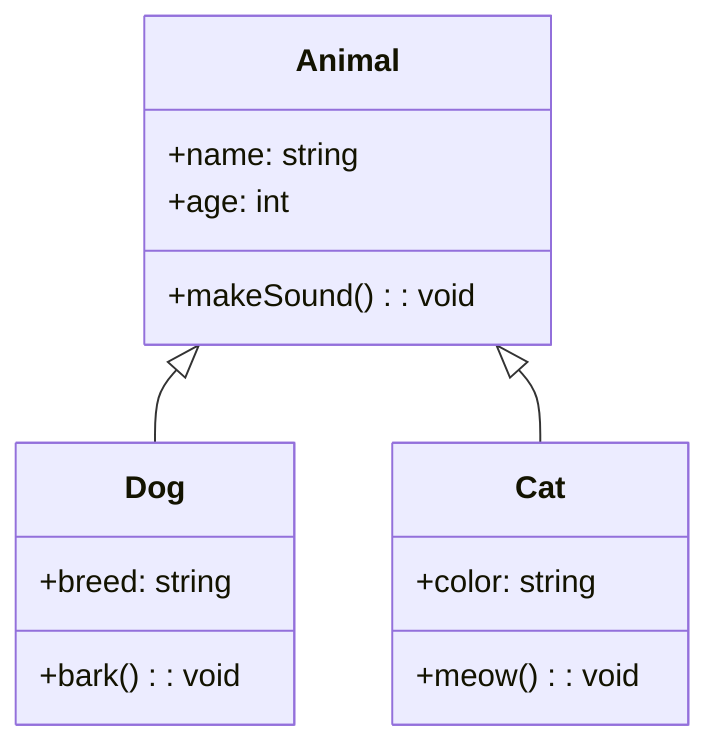
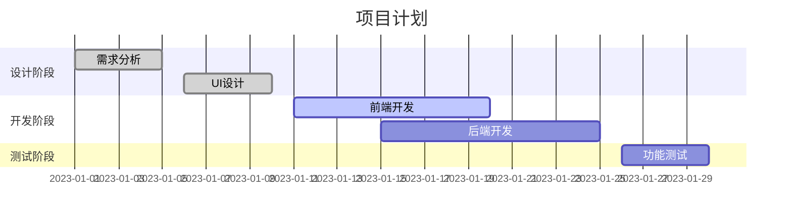
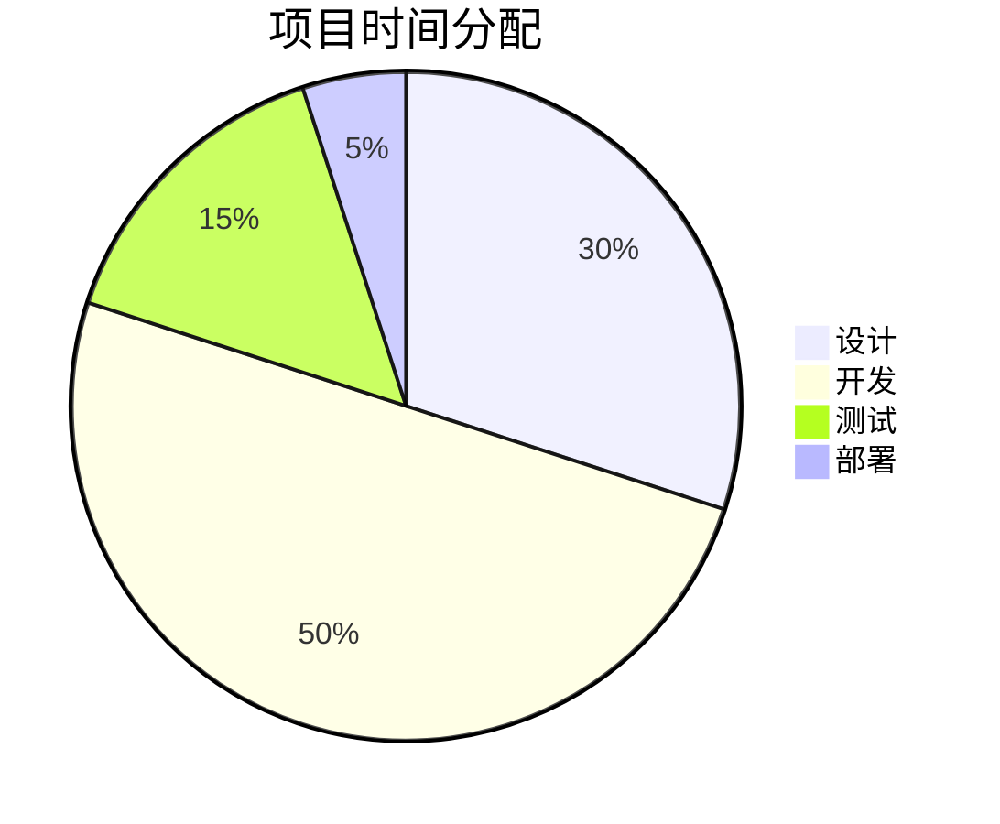
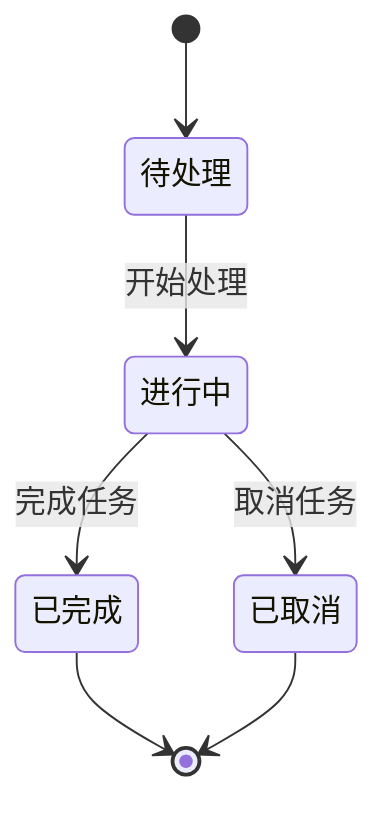

# Mermaid 图表示例

这是一个 Mermaid 图表示例文件，用于测试 Mermaid 图表功能。

## 流程图示例

## 时序图示例

## 类图示例

## 甘特图示例

## 饼图示例

## 状态图示例

## 使用说明

1. 在 Markdown 文件中使用 \`\`\`mermaid 和 \`\`\` 包裹 Mermaid 图表代码
2. 支持多种图表类型：流程图、时序图、类图、甘特图、饼图、状态图等
3. 在即时模式下，可以直接编辑和预览 Mermaid 图表